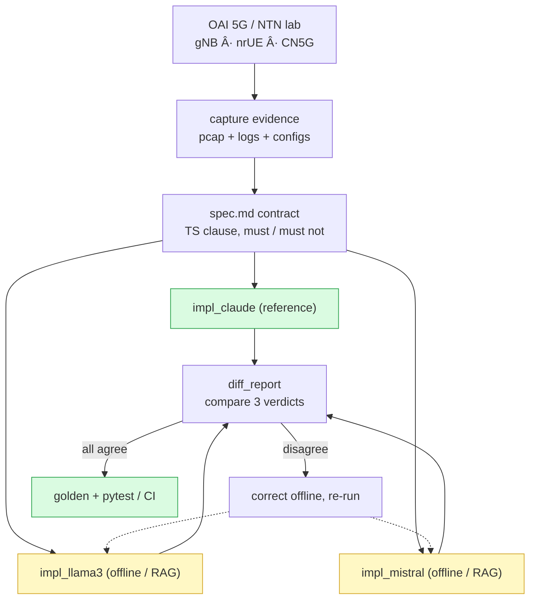
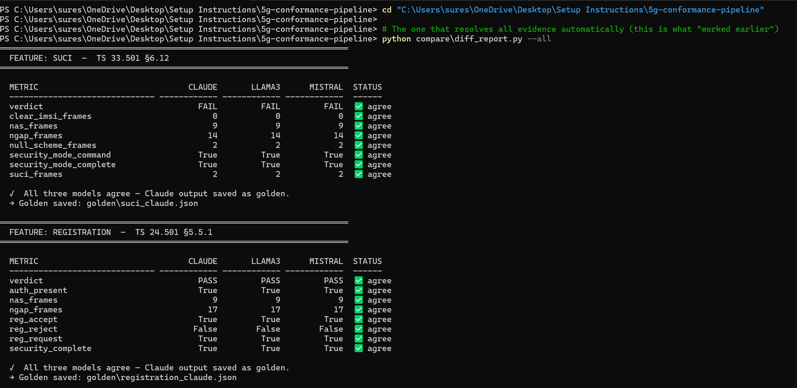
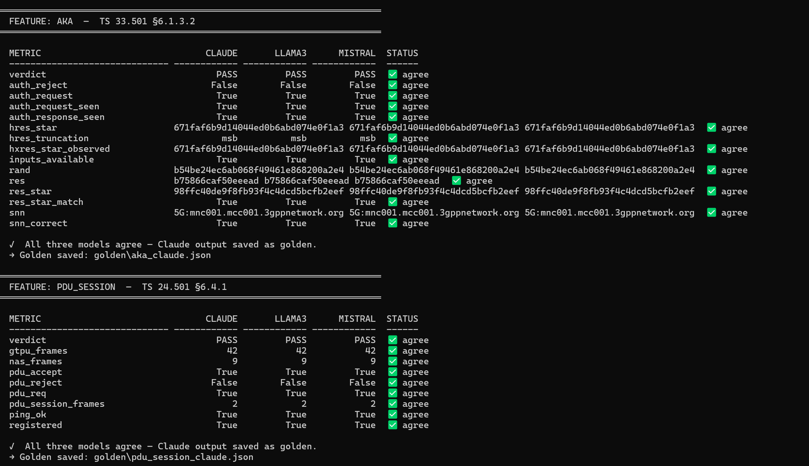
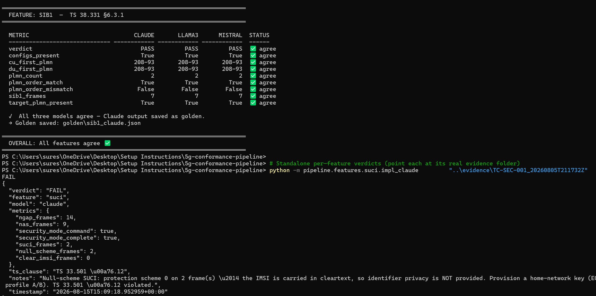
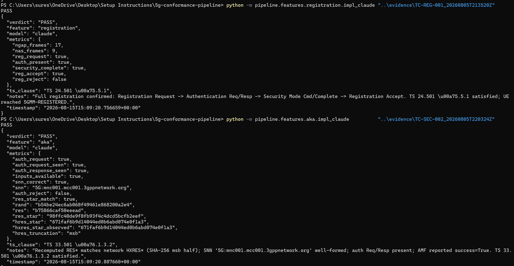
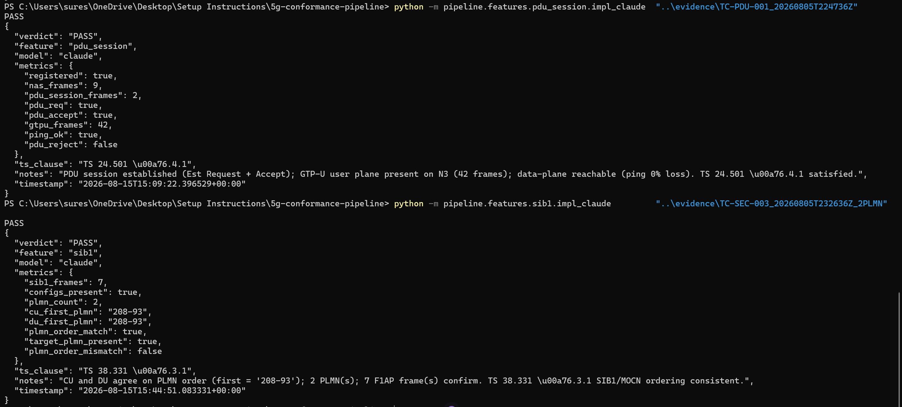

# 3GPP LTE, 5G and 6G Pipeline

### Offline 3GPP conformance grading with a three-verifier cross-check


> ℹ️ The RAG generator and lab/RAG internals live in a **private companion repo**. This public repo is the conformance pipeline: spec contracts, three-model verifiers, compare, golden, tests, and docs.

Offline **3GPP LTE / 5G / 6G conformance verification**: run three independent graders on the same lab evidence, compare them, and freeze a golden result when they agree.

The three implementations are intentional:

| Role | Module |
|------|--------|
| **Reference** | `impl_claude.py` |
| **Offline model A** | `impl_llama3.py` |
| **Offline model B** | `impl_mistral.py` |

Claude-vs-open-source comparison is part of the design. Do not strip `claude` names or files.

---

## Flow



Diagrams: [pipeline flow](docs/pipeline_flowchart.svg) · [system architecture](docs/system_architecture.svg) · full setup story: [docs/SETUP_AND_ARCHITECTURE.md](docs/SETUP_AND_ARCHITECTURE.md)

## Results

Real runs with three-model agreement. Full write-up: [docs/RESULTS.md](docs/RESULTS.md). All five features graded; SUCI defect caught; golden frozen.



Three-way `diff_report --all`: SUCI FAIL on null-scheme (IMSI in cleartext) and Registration PASS.



Three-way `diff_report --all`: 5G-AKA PASS (RES* matches HXRES*) and PDU Session PASS.



SIB1/MOCN PASS, overall agreement, plus standalone SUCI verifier FAIL with the TS 33.501 note.



Standalone Registration PASS and 5G-AKA PASS against captured evidence folders.



Standalone PDU Session PASS (GTP-U + ping) and SIB1 PASS (CU/DU PLMN order).

---


## What it checks

Each feature lives under `pipeline/features/<name>/` with the three impls, tests, and `evidence/`.

| Feature | Test ID | Clause (see runbooks) |
|---------|---------|------------------------|
| SUCI concealment | TC-SEC-001 | TS 33.501 §6.12 / §6.1.3 |
| Registration | TC-REG-001 | TS 24.501 §5.5.1 |
| 5G-AKA (RES*) | TC-SEC-002 | TS 33.501 §6.1.3.2 |
| PDU session | TC-PDU-001 | TS 24.501 §6.4.1 |
| SIB1 / multi-PLMN order | TC-SEC-003 | TS 38.331 §6.3.1 |

Verifiers read captures/logs. They do not control the live RAN. Raw pcaps for a run usually sit next to the repo under `../evidence/<TEST-ID>_<timestamp>/` (see `docs/RUN_GUIDE.md`).

---

## Layout

```
5g-conformance-pipeline/
├── compare/diff_report.py          # three-way compare + golden freeze
├── golden/                         # frozen Claude JSON (regression guard)
├── pipeline/
│   ├── shared/                     # VerificationResult, tshark helpers
│   └── features/<name>/
│       ├── impl_claude.py
│       ├── impl_llama3.py
│       ├── impl_mistral.py
│       ├── test_<name>.py
│       └── evidence/               # last compare artefacts (keep in git)
└── docs/                           # explainer, run guide, runbooks
```

Offline verifier generation (`gen_offline_impl.py` and the local 3GPP RAG) lives in a **private companion repo**, not in this public tree.

---

## Workflow

1. Capture evidence on the OAI lab (runbooks in `docs/runbooks/`).
2. Run one reference verifier (optional):

```powershell
python -m pipeline.features.suci.impl_claude "..\evidence\TC-SEC-001_<timestamp>"
```

3. Compare all three models (main command):

```powershell
pip install -r requirements.txt
python compare\diff_report.py --all
python compare\diff_report.py --feature suci
```

When all three agree, `diff_report.py` writes `golden/<feature>_claude.json`.

4. Regression / human oracle:

```powershell
pytest -q
```

---

## Setup

- Python 3.10+
- Wireshark / `tshark` on PATH (pcap features)
- `pycryptodome` for AKA (Milenage AES)
- Optional: Ollama (`llama3.1`, `mistral`) only if you regenerate offline impls (private companion)

```powershell
cd "C:\Users\sures\OneDrive\Desktop\Setup Instructions\5g-conformance-pipeline"
pip install -r requirements.txt
```

More detail: [`docs/RUN_GUIDE.md`](docs/RUN_GUIDE.md) · [`docs/EXPLAINER.md`](docs/EXPLAINER.md)

---

## Honesty

- Lab / RFsim evidence, not an over-the-air certification campaign.
- `impl_claude` is the trusted reference. Offline models draft; humans correct until the three-way report agrees.
- A SUCI **FAIL** on null-scheme (IMSI in the clear) is a real lab finding, not a decoder bug.

---


---

## License / Rights

All Rights Reserved. This public repository is a showcase; see LICENSE. No permission is granted to use, copy, modify, or distribute any part of this repository without prior written consent.

## Author

Suresh Ramadolla

