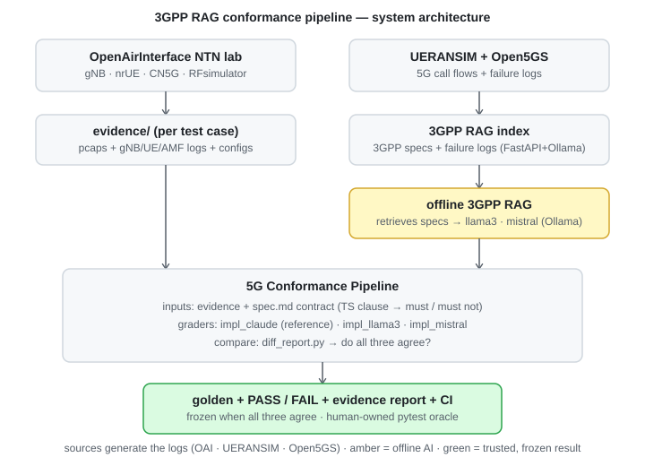
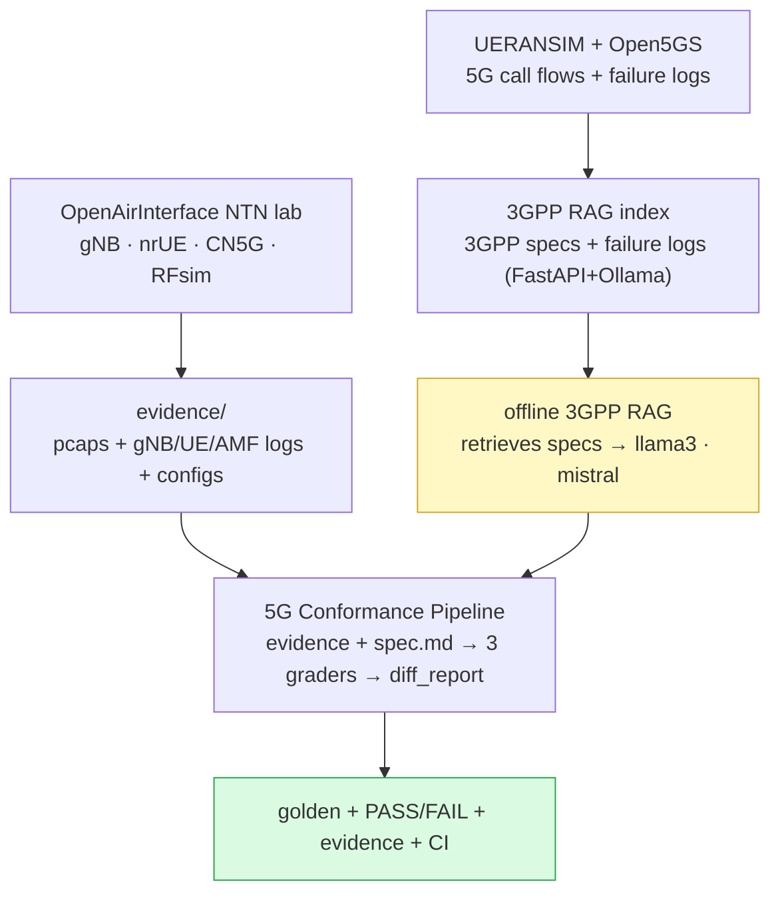

# Setup & architecture — from lab to pipeline

How the whole system fits together: the labs that **generate the logs**, the offline **3GPP RAG**
that grounds the AI, and the **conformance pipeline** that grades everything.

---

## The four components (and where each lives locally)

| # | Component | Local folder | Role |
|---|---|---|---|
| 1 | **OpenAirInterface NTN lab** | `5g-ntn-emulation-lab - Cursor` | Software 5G SA/NTN stack (RFsimulator). **Generates the evidence** — the pcaps + gNB/UE/AMF logs the pipeline grades. |
| 2 | **UERANSIM + Open5GS + 3GPP RAG** | `3GPP_Spec_Test` | A UERANSIM/Open5GS 5G stack plus an offline RAG (FastAPI + Ollama) indexing **3GPP specs and 5G failure logs**. Grounds the offline AI models. |
| 3 | **Evidence** | `evidence/` | The captured logs per test case (`TC-*_<timestamp>/`). |
| 4 | **Conformance pipeline** *(this repo)* | `5g-conformance-pipeline` | Grades the evidence against the spec, runs the three-model comparison, freezes golden. |

> **Log provenance (stated plainly):** the captures the pipeline verifies are produced by real 5G
> tooling — **OpenAirInterface** for the NTN lab captures, and **UERANSIM + Open5GS** for the 5G
> call-flow and failure-log corpus that feeds the RAG. The pipeline never drives the live network;
> it only analyses what these tools captured.

---

## End-to-end usage (setup → result)

1. **Bring up a 5G stack** and run a scenario:
   - OpenAirInterface (NTN lab) for the NTN/RFsim captures, **or**
   - UERANSIM + Open5GS for terrestrial 5G call flows / failure logs.
2. **Capture** the pcaps + logs (see `docs/runbooks/`). They land in `evidence/<TEST-ID>_<timestamp>/`.
3. **(Offline AI, optional)** the 3GPP RAG retrieves the relevant TS clauses and a local model
   (`llama3`, `mistral`) drafts the offline verifiers — see `docs/OLLAMA_CALIBRATION.md`.
4. **Grade it**: `python compare\diff_report.py --all` runs all three graders against the evidence,
   compares them, and freezes `golden/` when they agree.
5. **Guard it**: `pytest -q` (human-owned oracle) + CI keep it from regressing.

Full commands: **[`RUN_GUIDE.md`](RUN_GUIDE.md)**.

---

## Public vs private (what goes to GitHub)

This repo is the **framework**. The heavy / sensitive parts stay local (and are `.gitignore`d):

| Keep **public** (push) | Keep **private / local** (do not push) |
|---|---|
| the pipeline code (`pipeline/`, `compare/`) | RAG generator (`gen_offline_impl.py`) — private companion repo |
| the specs, tests, golden JSON | the 3GPP RAG index + spec corpus (`3GPP_Spec_Test`, multi-GB) |
| docs, flowcharts | the OAI / UERANSIM / Open5GS lab configs & keys |
| small evidence *reports* (json/md) | raw pcaps (`*.pcap`, `*.pcapng`) and AI drafts (`*.generated.py`) |

If you want the whole repo private, just create the GitHub repo as **Private** (see
`docs/GITHUB_PUSH.md`). Either way the `.gitignore` keeps captures and lab internals out of git.

---

## Docs index

| Doc | For |
|---|---|
| [EXPLAINER.md](EXPLAINER.md) | anyone — plain-English, no jargon |
| [SETUP_AND_ARCHITECTURE.md](SETUP_AND_ARCHITECTURE.md) | this file — how it all connects |
| [RUN_GUIDE.md](RUN_GUIDE.md) | from-scratch, every command |
| [pipeline_flowchart.svg](pipeline_flowchart.svg) · [system_architecture.svg](system_architecture.svg) | the diagrams |
| [SCREENSHOTS.md](SCREENSHOTS.md) | the shot list for posts |
| [GITHUB_PUSH.md](GITHUB_PUSH.md) | push it to GitHub, step by step |
| [CALIBRATION_LOG.md](CALIBRATION_LOG.md) · [OLLAMA_CALIBRATION.md](OLLAMA_CALIBRATION.md) | the offline-AI story |
| [INTERVIEW_PREP.md](INTERVIEW_PREP.md) | interviews |
| [publication/POSTS.md](publication/POSTS.md) | Medium / GitHub / resume drafts |
| [NTN_TEST_CASES.md](NTN_TEST_CASES.md) · [runbooks/](runbooks/) · [reference/](reference/) | test cases, lab runbooks, 3GPP spec indexes |
